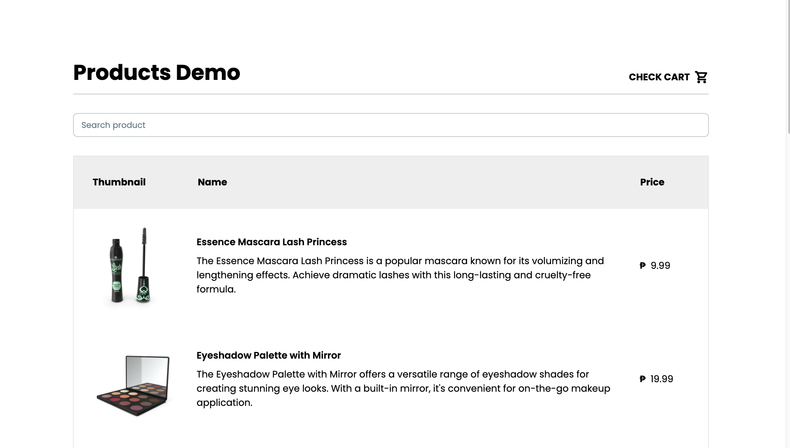
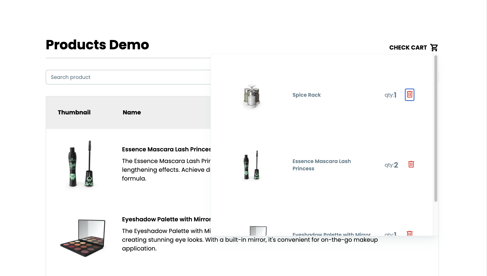
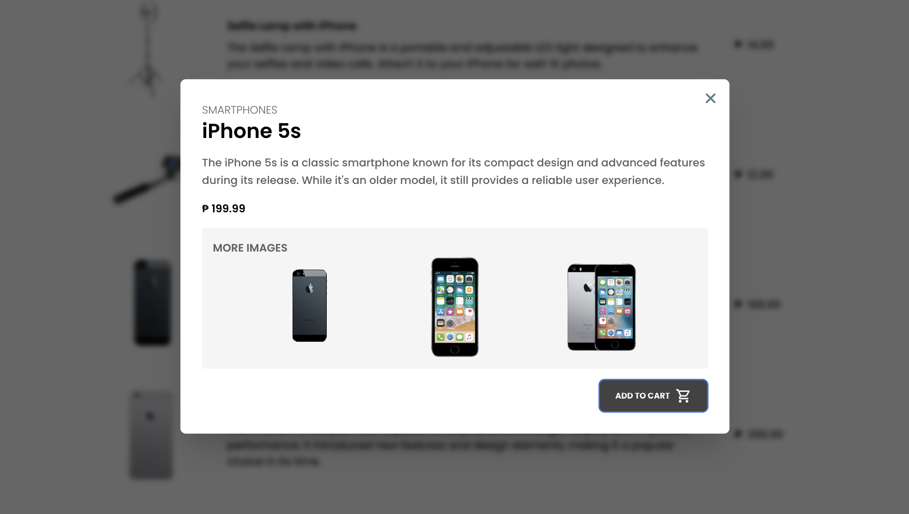

This is a project created with Vite + React

- Caching product list and debounced search to optimize API/network calls.
- Pagination and storing page in URL for better browser accessibility
- persistent cart with local storage

### Dependencies

react-router-dom, @tanstack/react-query, @material-tailwind/react
devDependencies: TypeScript, Tailwind

## Setup

1. Clone the repository

```
git clone https://github.com/Randell-janus/dummy-product-list.git
```

2. Install packages

```
npm install
```

4. Run the project

```
npm run dev
```

## Views

- Home page
  
- Cart
  
- Modal
  
